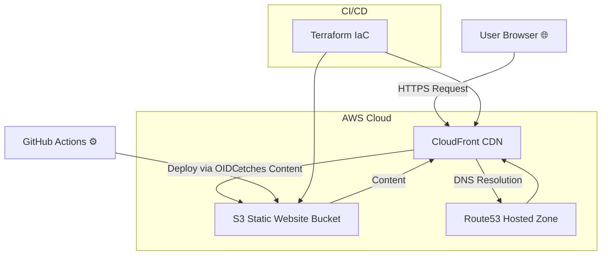

# 🧰 RD Service Pros — Static Website

A modern, responsive static website for **RD Service Pros**, a local home repair and appliance service business in **Navarre, Florida**.  
This project demonstrates full-cycle web development, infrastructure automation, and DevOps best practices.

---

## 🌐 Live Demo
[**rdservicepros.com**](https://rdservicepros.com)

Hosted entirely on **AWS S3 + CloudFront**, with DNS on **Route53** and automatic invalidations through Terraform.

---

## 🏗️ Tech Stack

| Layer | Technology | Description |
|-------|-------------|-------------|
| **Frontend** | HTML5, Bootstrap 5, Bootstrap Icons | Responsive static site with smooth scrolling and adaptive gallery |
| **Infrastructure** | AWS S3, CloudFront, Route53 | Secure static hosting with HTTPS and CDN caching |
| **Automation / IaC** | Terraform | Full environment provisioning & CloudFront invalidations |
| **CI/CD (optional)** | GitHub Actions | Auto-deploys to S3 on push |
| **Security** | IAM + OIDC, no secrets in repo | SSM Parameter Store for config, HTTPS enforced |
| **Design** | Glassmorphism / Neon RGB accents | Matches branding colors and logo identity |

---

## 📊 Infrastructure Diagram (Mermaid)



---

## 🧩 Key Features

- **Responsive Design:** Fully optimized for mobile and tablet devices  
- **Smooth Scrolling:** CSS-driven page transitions for better UX  
- **OpenStreetMap Integration:** Secure, keyless map centered on Navarre, FL  
- **SEO & Social Meta Tags:** OG + canonical tags for better visibility  
- **Clean Repo:** No Mobirise leftovers, one clean commit history  
- **Commented Code:** English section comments throughout `index.html`  
- **Accessibility Ready:** All images have descriptive `alt` tags  

---

## 📁 Project Structure

```
rdservicepros-site/
├── infra/
│   └── terraform/       # Infrastructure-as-Code for AWS (S3, CloudFront, Route53)
├── site/
│   ├── assets/          # CSS, JS, images, Bootstrap, icons
│   ├── index.html       # Main site entry
│   └── ...              # Supporting static files
└── README.md
```

---

## ⚙️ Deployment Workflow

1. Run Terraform:
   ```bash
   cd infra/terraform
   terraform init
   terraform apply
   ```

2. Deploy site updates:
   ```bash
   aws s3 sync site s3://$(terraform output -raw bucket_name) --delete
   aws cloudfront create-invalidation \
     --distribution-id $(terraform output -raw cloudfront_distribution_id) \
     --paths "/*"
   ```

---

## 🧠 Lessons & Highlights

- Full AWS static hosting pipeline built with **Terraform**  
- Infrastructure as Code + security best practices (no secrets, IAM roles)  
- Responsive web design principles applied to real business site  
- Migrated from legacy Mobirise → modern clean HTML5/Bootstrap base  

---

## 👨‍💻 Author

**Ruslan Dashkin**  
DevOps & Cloud Engineer | Founder @ RD Service Pros  
📧 [rdservicepros9@gmail.com](mailto:rdservicepros9@gmail.com)  
🌐 [www.rdservicepros.com](https://rdservicepros.com)

---

> 🧩 _“Built with precision and simplicity — from DevOps to design.”_
