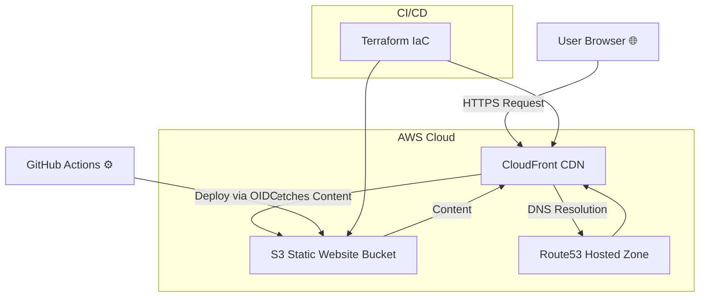
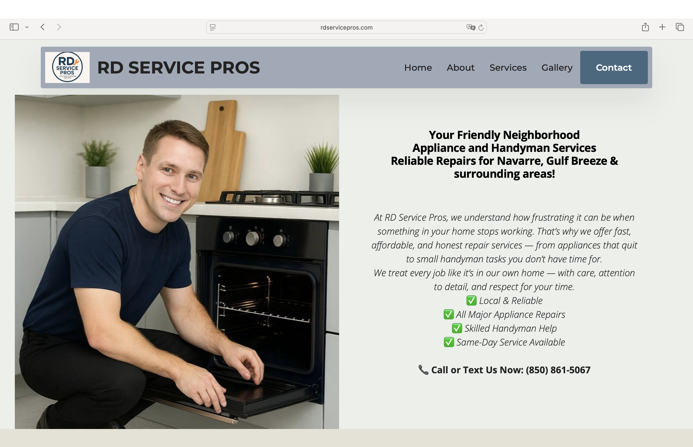
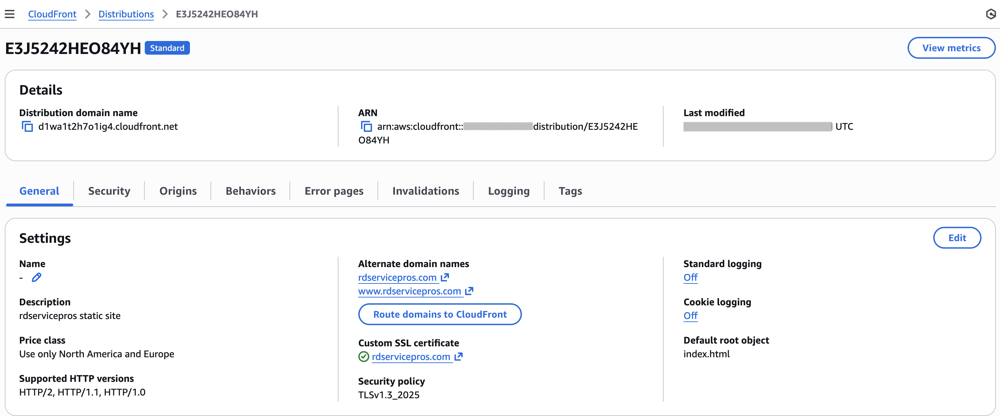
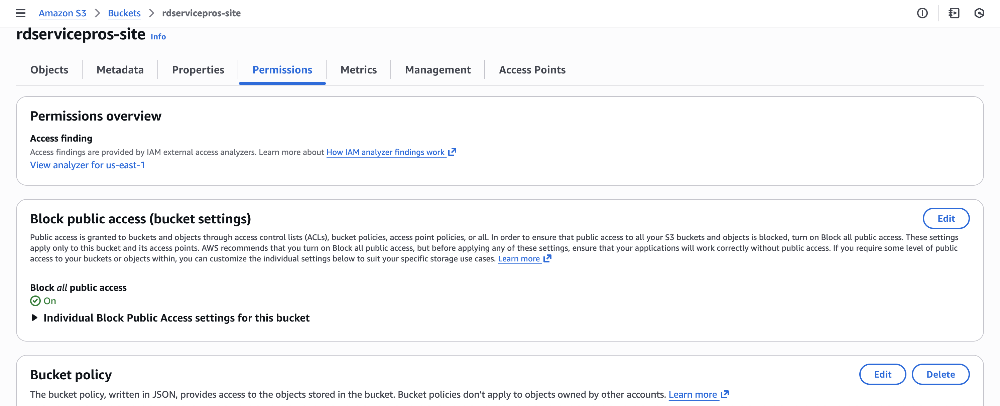
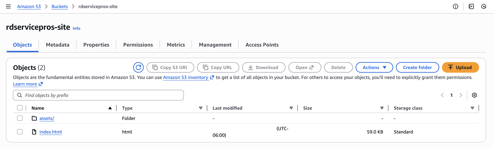
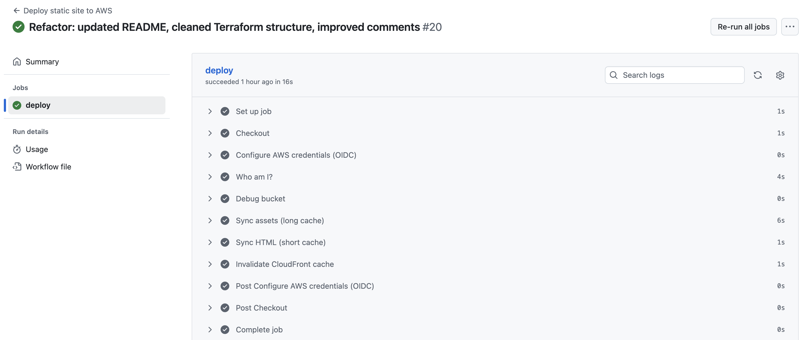
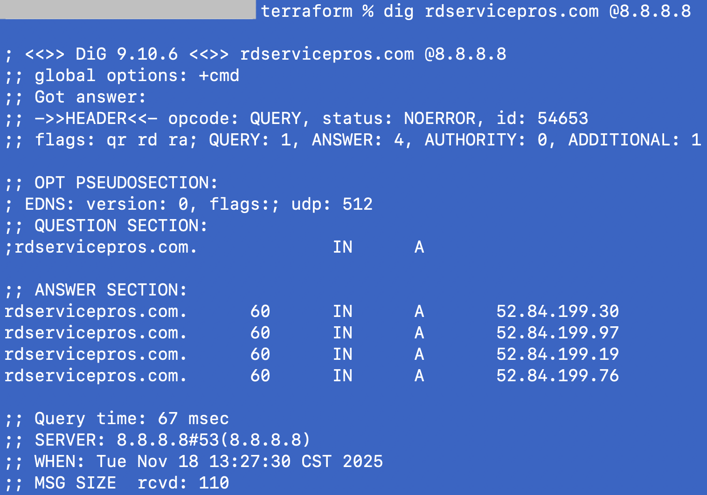

# 🧰 RD Service Pros --- Production Static Website (S3 + CloudFront + Terraform)


A fully automated, production-grade static website for **RD Service
Pros**, a home repair & appliance service company in **Navarre,
Florida**.\
The project demonstrates **end-to-end DevOps engineering**, including
infrastructure-as-code, CDN-level optimization, secure deployments, and
real incident resolution.

## 🌐 Live Demo

👉 **https://rdservicepros.com**

Built using **AWS S3 + CloudFront**, with DNS routed through
**Route53**, and deployed via **GitHub Actions OIDC** (no access keys).

## ⚙️ Tech Stack Overview

| Layer       | Technology                 | Purpose                                                           |
|-------------|----------------------------|-------------------------------------------------------------------|
| Frontend    | HTML5, Bootstrap 5, JS     | Responsive, production-ready static site                          |
| Hosting     | S3 (private)               | Secure static content origin                                      |
| CDN         | CloudFront (OAC)           | HTTPS delivery, edge caching, compression                         |
| DNS         | Route53                    | Apex + www A-aliases, ACM DNS validation                          |
| Security    | IAM Roles + OIDC           | GitHub Actions assumes an IAM role — no long-lived AWS keys used |
| IaC         | Terraform                  | Full infrastructure provisioning and configuration                 |
| CI/CD       | GitHub Actions             | Automated deploy + CloudFront invalidation                        |

## 🏆 Production-Grade Features

-   Multi-account domain setup (registrar in A → hosted zone +
    CloudFront in B)\
-   Private S3 bucket --- **no public ACLs**, access only via CloudFront
    OAC\
-   ACM certificate in `us-east-1` for CloudFront, DNS-validated\
-   Smart caching strategy:
    -   **HTML = 60 seconds**\
    -   **Assets = 1 year**\
-   Zero access keys --- GitHub Actions assumes IAM role via OIDC\
-   Automatic CloudFront invalidations on deploy\
-   Fully reproducible infrastructure using Terraform\
-   Custom 404 page + forced HTTPS\
-   Clean resource naming & consistent tagging

## ⚡ Performance Optimizations

This static hosting setup is tuned for **fast global delivery** and
**low-cost performance**:

### **1. Smart Cache Strategy**

-   **HTML → 60s TTL**
-   **Static assets → 1 year TTL**
-   Automatic CloudFront invalidations per deploy

### **2. Compression & HTTP Optimization**

-   Brotli/Gzip compression\
-   HTTP/2 & HTTP/3 support\
-   Optimized assets

### **3. Edge-Cached Routing**

-   Apex + www served entirely from CloudFront\
-   \~400 global edge locations

### **4. Zero Redirect Chain**

-   HTTPS-only\
-   Proper domain aliasing

### **5. Cost Optimization**

-   PriceClass_100\
-   Zero compute\
-   High cache-hit ratio

## 📊 Architecture Diagram (Mermaid)



## 📁 Project Structure

```
rdservicepros-site/
├── docs/
│   └── screenshots/
│       ├── 1-frontend-home.png
│       └── ...
├── infra/
│   └── terraform/
│       ├── providers.tf
│       ├── variables.tf
│       ├── main.tf
│       └── outputs.tf
│
├── site/
│   ├── assets/
│   │   ├── css/
│   │   ├── js/
│   │   ├── images/
│   │   └── ...
│   ├── index.html
│   └── ...
│
└── README.md
```

## ⚙️ How to Deploy (CI/CD or Manual)

### Terraform

``` bash
cd infra/terraform
terraform init
terraform apply
```

### Manual Deployment

``` bash
aws s3 sync site s3://$(terraform output -raw bucket_name) --delete

aws cloudfront create-invalidation     --distribution-id $(terraform output -raw cloudfront_distribution_id)     --paths "/*"
```

## 🚨 Real Incident Case Study (DNS Failure Fix)

### Symptoms

-   `www.rdservicepros.com` worked\
-   `rdservicepros.com` failed globally

### Root Cause

Registrar NS did not match newly created Route53 hosted zone.

### Fix

-   Updated NS at registrar\
-   Recreated A-alias records\
-   Validated global propagation

### Lessons

-   Always verify hosted zone → registrar sync\
-   CloudFront TLS depends on correct DNS\
-   DNS validation using public recursive resolvers:
-   Google DNS (8.8.8.8) — authoritative and successful
-   Cloudflare DNS (1.1.1.1) — may be filtered by local ISP/WiFi networks

## 🔍 Highlights & Engineering Decisions

-   OAC instead of OAI (modern secure origin auth)\
-   BucketOwnerEnforced mode\
-   Dual A-alias routing\
-   Split TTL caching\
-   Strict IAM OIDC roles\
-   Terraform with create_before_destroy for ACM\
-   Multi-line, comment-structured Terraform (Ruslan AWS style)

## 🧠 What This Project Demonstrates

-   Real production static hosting\
-   Strong AWS infrastructure knowledge\
-   Secure CI/CD\
-   Real-world DNS debugging\
-   Clean Terraform architecture

## Screenshots

### 1. Customer-facing home page

This screenshot shows the public RD Service Pros website as delivered through CloudFront.  
It demonstrates the final look-and-feel of the static site: branding, layout, navigation menu, and main call-to-action for customers.



---

### 2. CloudFront distribution configuration

This view shows the CloudFront distribution that serves the static site.  
You can see the custom domain names (`rdservicepros.com` and `www.rdservicepros.com`), attached ACM certificate, default root object, and general settings used for the CDN.



---

### 3. S3 bucket permissions (private origin)

This screenshot highlights the S3 bucket permissions for `rdservicepros-site`.  
Public access is fully blocked and the bucket policy only allows access from CloudFront via Origin Access Control (OAC), so the website is not directly exposed from S3.



---

### 4. S3 bucket objects (static site contents)

Here you can see the actual website assets stored in S3.  
The bucket hosts `index.html` and an `assets/` folder with CSS, JavaScript, and images that are synchronized from the `site/` directory using the GitHub Actions workflow.



---

### 5. GitHub Actions deploy workflow

This screenshot shows a successful run of the “Deploy static site to AWS” GitHub Actions workflow.  
The pipeline authenticates to AWS via OIDC, syncs static assets to S3 with different cache policies, and triggers a CloudFront cache invalidation so new content becomes visible quickly.



---

### 6. DNS and CloudFront resolution

The final screenshot demonstrates DNS resolution for `rdservicepros.com` using `dig` against Google Public DNS (`8.8.8.8`).  
It confirms that the apex domain correctly resolves to the CloudFront IPs, proving that Route 53 and CloudFront are wired together as expected.



## 🧾 License

Released under the **MIT License**   
© Ruslan Dashkin (🚀Ruslan AWS)
Branding name “🚀Ruslan AWS” and related visuals are protected; commercial reuse or rebranding without permission is prohibited.