# RD Service Pros — Production Static Website (S3 + CloudFront + Terraform)

<p align="center">
  
  
  
  
  
  <br/>
  
  
  

</p>

A fully automated, production-grade static website for **RD Service
Pros**, a home repair & appliance service company in **Navarre,
Florida**.\
The project demonstrates **end-to-end DevOps engineering**, including
infrastructure-as-code, CDN-level optimization, secure deployments, and
real incident resolution.

##  Live Demo

 **https://rdservicepros.com**

Built using **AWS S3 + CloudFront**, with DNS routed through
**Route53**, and deployed via **GitHub Actions OIDC** (no access keys).

---

##  Tech Stack Overview

| Layer       | Technology                 | Purpose                                                           |
|-------------|----------------------------|-------------------------------------------------------------------|
| Frontend    | HTML5, Bootstrap 5, JS     | Responsive, production-ready static site                          |
| Hosting     | S3 (private)               | Secure static content origin                                      |
| CDN         | CloudFront (OAC)           | HTTPS delivery, edge caching, compression                         |
| DNS         | Route53                    | Apex + www A-aliases, ACM DNS validation                          |
| Security    | IAM Roles + OIDC           | GitHub Actions assumes an IAM role — no long-lived AWS keys used  |
| IaC         | Terraform                  | Full infrastructure provisioning and configuration                |
| CI/CD       | GitHub Actions             | Automated deploy + CloudFront invalidation                        |

---

##  Production-Grade Features

-   Multi-account domain setup (registrar in A → hosted zone +
    CloudFront in B)\
-   Private S3 bucket --- **no public ACLs**, access only via CloudFront
    OAC\
-   ACM certificate in `us-east-1` for CloudFront, DNS-validated\
-   Smart caching strategy:
    -   **HTML = 60 seconds**\
    -   **Assets = 1 year**\
-   Zero access keys --- GitHub Actions assumes IAM role via OIDC\
-   Automatic CloudFront invalidations on deploy\
-   Fully reproducible infrastructure using Terraform\
-   Custom 404 page + forced HTTPS\
-   Clean resource naming & consistent tagging

---

##  Performance Optimizations

This static hosting setup is tuned for **fast global delivery** and
**low-cost performance**:

### **1. Smart Cache Strategy**

-   **HTML → 60s TTL**
-   **Static assets → 1 year TTL**
-   Automatic CloudFront invalidations per deploy

### **2. Compression & HTTP Optimization**

- Brotli/Gzip compression  
- HTTP/2 support  
- Optimized static assets

### **3. Edge-Cached Routing**

-   Apex + www served entirely from CloudFront\
-   \~400 global edge locations

### **4. Zero Redirect Chain**

-    Minimal redirects (HTTP → HTTPS only, no extra redirect chains)
-    Proper domain aliasing

### **5. Cost Optimization**

-   PriceClass_100\
-   Zero compute\
-   High cache-hit ratio
   
---

##  Architecture Diagram (Mermaid)

```mermaid
graph TD
    A[User Browser 🌐] -->|HTTPS Request| B[CloudFront CDN]
    B -->|Fetches Content| C[S3 Static Website Bucket]
    B -->|DNS Resolution| D[Route53 Hosted Zone]
    E[GitHub Actions ⚙️] -->|Deploy via OIDC| C
    subgraph AWS Cloud
        C -->|Content| B
        D --> B
    end
    subgraph CI/CD
        F[Terraform IaC] --> C
        F --> B
    end
```



---

## **Project Structure**

```
rdservicepros-site/
├── docs/                     # Documentation & screenshots
├── infra/                    # Terraform IaC (S3, CloudFront, Route53, OIDC)
├── site/                     # Static website source (HTML + assets)
├── .github/                  # CI/CD workflows
├── README.md                 # Project overview
├── LICENSE                   # MIT license + branding notice
├── .gitignore                # Repo hygiene rules
└── .tfsec.yml                # Security scanning configuration
```
**Full detailed structure:** see [`docs/architecture.md`](./docs/architecture.md)

---

##  How to Deploy (CI/CD or Manual)

### Terraform

``` bash
cd infra/terraform
terraform init
terraform apply
```

### Manual Deployment

``` bash
aws s3 sync site s3://$(terraform output -raw bucket_name) --delete

aws cloudfront create-invalidation \
  --distribution-id $(terraform output -raw cloudfront_distribution_id) \
  --paths "/*"
```
---

##  Infrastructure & Security Checks

This project uses a full IaC validation pipeline to ensure correctness, security, and consistency:

| Tool        | Purpose                                                      |
|-------------|--------------------------------------------------------------|
| **terraform validate / fmt** | Syntax checks and formatting                           |
| **TFLint**  | Provider-aware linting (AWS rules, deprecated args, typos)  |
| **tfsec**   | Security scanning with selected rules excluded               |
| **Checkov** | Deep IaC policy evaluation (all current checks passed)       |
| **GitHub Actions** | Optional CI integration for automated scanning            |

###  Why some rules are excluded

Certain tfsec / checkov rules were intentionally ignored because:

- **They increase AWS cost** (WAF, S3 versioning, CloudFront logging, KMS CMKs)  
- **They are unnecessary for a static brochure-style site** (no backend, no data retention, no sensitive compute)
- **They do not improve real-world security for this architecture**  
  Example: Enforcing KMS CMK encryption on a public static website bucket has **no practical benefit**, but costs money.
- **Some rules are false positives** due to CloudFront provider quirks (e.g., TLS policy mismatches)

This keeps the project:
- **Fully secure**
- **Minimalistic**
- **Free-tier friendly**
- **Aligned with the real threat model** (no user data, no API surface, no dynamic workloads)

---

### Run all checks locally (optional, for full hygiene)

```bash
terraform fmt -recursive
terraform validate
tflint
tfsec .
checkov -d infra/terraform
```

---

##  Real Incident Case Study (DNS Failure Fix)

### Symptoms

-   `www.rdservicepros.com` worked\
-   `rdservicepros.com` failed globally

### Root Cause

Registrar NS did not match newly created Route53 hosted zone.

### Fix

-   Updated NS at registrar\
-   Recreated A-alias records\
-   Validated global propagation

### Lessons

-   Always verify hosted zone → registrar sync\
-   CloudFront TLS depends on correct DNS\
-   DNS validation using public recursive resolvers:
-   Google DNS (8.8.8.8) — authoritative and successful
-   Cloudflare DNS (1.1.1.1) — may be filtered by local ISP/WiFi networks

##  Highlights & Engineering Decisions

-   OAC instead of OAI (modern secure origin auth)\
-   BucketOwnerEnforced mode\
-   Dual A-alias routing\
-   Split TTL caching\
-   Strict IAM OIDC roles\
-   Terraform with create_before_destroy for ACM\
-   Multi-line, comment-structured Terraform (Ruslan AWS style)

##  What This Project Demonstrates

-   Real production static hosting\
-   Strong AWS infrastructure knowledge\
-   Secure CI/CD\
-   Real-world DNS debugging\
-   Clean Terraform architecture
   
---

## Screenshots

### 1. Customer-facing home page

This screenshot shows the public RD Service Pros website as delivered through CloudFront.  
It demonstrates the final look-and-feel of the static site: branding, layout, navigation menu, and main call-to-action for customers.


---

### 2. CloudFront distribution configuration

This view shows the CloudFront distribution that serves the static site.  
You can see the custom domain names (`rdservicepros.com` and `www.rdservicepros.com`), attached ACM certificate, default root object, and general settings used for the CDN.


---

### 3. S3 bucket permissions (private origin)

This screenshot highlights the S3 bucket permissions for `rdservicepros-site`.  
Public access is fully blocked and the bucket policy only allows access from CloudFront via Origin Access Control (OAC), so the website is not directly exposed from S3.


---

### 4. S3 bucket objects (static site contents)

Here you can see the actual website assets stored in S3.  
The bucket hosts `index.html` and an `assets/` folder with CSS, JavaScript, and images that are synchronized from the `site/` directory using the GitHub Actions workflow.


---

### 5. GitHub Actions deploy workflow

This screenshot shows a successful run of the “Deploy static site to AWS” GitHub Actions workflow.  
The pipeline authenticates to AWS via OIDC, syncs static assets to S3 with different cache policies, and triggers a CloudFront cache invalidation so new content becomes visible quickly.


---

### 6. DNS and CloudFront resolution

The final screenshot demonstrates DNS resolution for `rdservicepros.com` using `dig` against Google Public DNS (`8.8.8.8`).  
It confirms that the apex domain correctly resolves to the CloudFront IPs, proving that Route 53 and CloudFront are wired together as expected.


---

## License

- Released under the **MIT License** — see `LICENSE` for full text.  
- © Ruslan Dashkin (“🚀 Ruslan AWS”).  
- Branding name “🚀 Ruslan AWS” and related visuals may not be reused, redistributed, or rebranded without explicit permission.